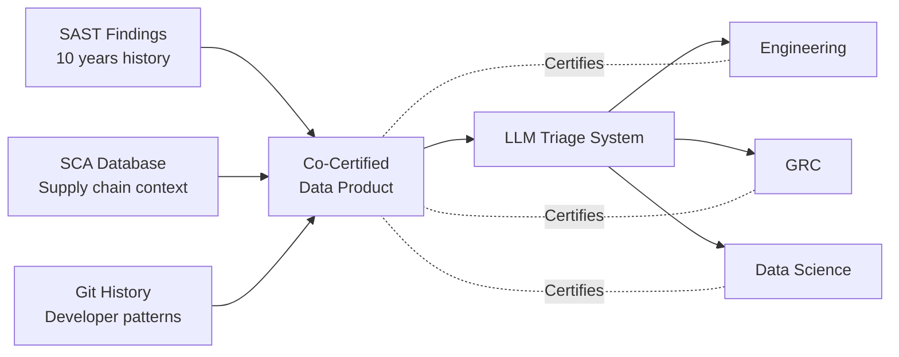
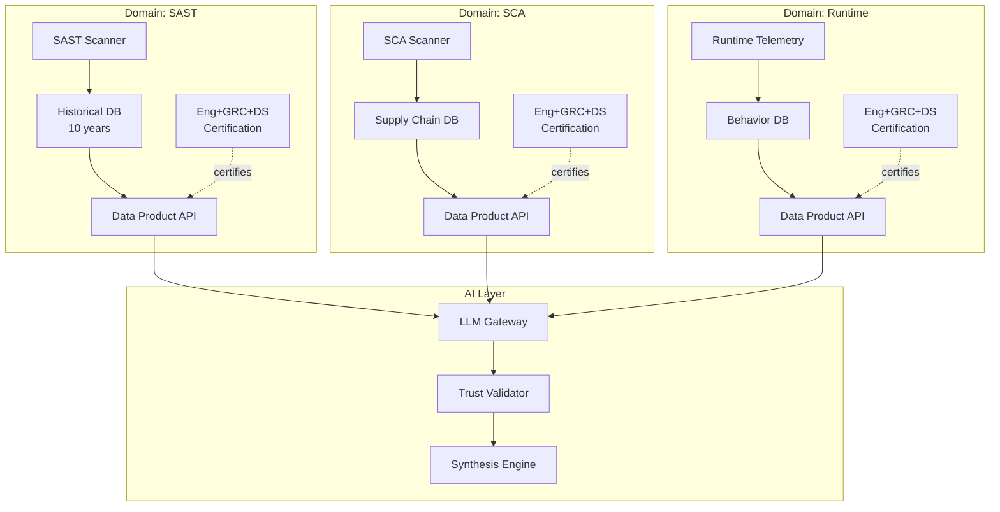

---
# Slidev Configuration
theme: ../themes/black-duck
highlighter: shiki
lineNumbers: true
favicon: /presentations/rsa-2026/theme/favicon.svg
slideFooter: 'RSA Conference 2026 | San Francisco'
info: |
  ## Dr. StrangeBot: How I Learned to Stop Worrying and Love Historical Security Data

  RSA Conference 2026
  Andrew Bolster, PhD
  Senior R&D Manager (Data Science), Black Duck

drawings:
  persist: false
transition: slide-left
title: 'Dr. StrangeBot: Historical Security Data'
author: 'Andrew Bolster'
presenter: true
download: true
exportFilename: dr-strangebot-rsa2026
---

# Dr. StrangeBot

## How I Learned to Stop Worrying and Love Historical Security Data

<div class="pt-12">
  <span class="text-3xl">
    Andrew Bolster, PhD
  </span>
</div>

<div class="pt-6 text-xl">
  Senior R&D Manager (Data Science)<br/>
  Black Duck
</div>

<!--
Welcome everyone. I'm Andrew Bolster, and today I want to challenge something the security industry has been selling for decades: the idea that if we could just get all our data into one place - one unified pane of glass - our security problems would be solved.

Spoiler: they won't be. And that's actually good news.
-->

---
layout: quote
---

# "The Single Pane of Glass Will Save Us"

### *— Every ASPM Vendor, Probably*

<!--
For years, the ASPM industry has been chasing this seductive promise. Consolidate everything. Unify your tools. End the chaos.

But here's the uncomfortable truth I've learned building AI systems that work with real security data...
-->

---

# The Uncomfortable Truth

<v-clicks>

- Your security data isn't trapped in silos because you chose the wrong platform
- It's distributed because **security is distributed**
- SAST findings with decade-old remediation context
- SCA data with supply chain lineage
- Runtime telemetry, developer patterns, institutional knowledge
- These sources were **never designed to interoperate**

</v-clicks>

<!--
Security isn't centralized because the threats aren't centralized. Your codebase has history. Your vulnerabilities have context. Your developers have patterns.

The question isn't how to centralize all this - it's how to make it talk to each other safely.
-->

---
layout: center
class: text-center accent
---

# The Answer: Federated Security Data

## Governance + Interoperability > Consolidation

<!--
What if instead of forcing everything into one platform, we treated our security data sources as governed products that can interoperate?

Let me introduce you to a different model.
-->

---

# The Three-Party Co-Certification Model

<div class="grid grid-cols-3 gap-8 pt-8">

<div v-click>
<div class="text-center">

### 🔧 Engineering
**Accuracy & Provenance**
- Data freshness
- Schema stability
- Source attribution

</div>
</div>

<div v-click>
<div class="text-center">

### ⚖️ GRC
**Compliance & Boundaries**
- Acceptable use
- Retention policies
- Privacy controls

</div>
</div>

<div v-click>
<div class="text-center">

### 🧪 Data Science
**Analytical Fitness**
- Quality metrics
- Bias assessment
- Model safety

</div>
</div>

</div>

<div v-click class="pt-12 text-center text-xl">

**When all three sign off → You have a certified Data Product**

</div>

<!--
Three parties, three domains of expertise.

Engineering owns the truth of the data. GRC owns the rules. Data Science owns fitness for purpose.

When they all agree, you've created something AI can responsibly consume - not because you've centralized it, but because you've established trust contracts.
-->

---
layout: two-cols
---

# Traditional Approach

<v-clicks>

- ❌ Centralize everything into one platform
- ❌ Break existing integrations
- ❌ Vendor lock-in
- ❌ Brittle monolithic architecture
- ❌ "Trust us, our AI knows best"

</v-clicks>

::right::

# Federated Approach

<v-clicks>

- ✅ Govern data at source
- ✅ Preserve existing workflows
- ✅ Platform interoperability
- ✅ Distributed, resilient
- ✅ "Trust, but verify - everywhere"

</v-clicks>

<!--
The old way: rip and replace. The new way: certify and federate.

One creates dependencies. The other creates resilience.
-->

---

# Case Study: LLM-Powered Vulnerability Triage



<v-clicks>

- Each source **independently governed** by domain experts
- Co-certification creates **trust contracts** between systems
- LLM synthesizes across sources it **trusts**
- Not because data is centralized, but because governance is **federated**

</v-clicks>

<!--
This is what it looks like in practice. Three different data sources, each with its own governance.

The LLM doesn't need them all in one database. It needs to trust that each one has been certified by people who understand what it represents.
-->

---

# Why This Works for AI

<v-clicks>

- 🎯 **LLMs are synthesis engines** - they excel at connecting disparate sources
- 🔒 **Trust contracts scale** - governance travels with the data
- 🏗️ **Architecture matches reality** - security data is inherently distributed
- 🚀 **Innovation at edges** - teams improve their data products independently
- ⚡ **Resilience** - no single point of failure

</v-clicks>

<div v-click class="pt-8 text-xl text-center">

**The organizations winning at AI-powered security aren't those with the cleanest data lakes**

**They're those who built trust frameworks for messy, real-world data**

</div>

<!--
AI isn't magic. It's pattern recognition at scale.

Give it trusted, well-governed sources - even if they're scattered - and it will find patterns you missed.

Try to force everything into one schema first, and you'll still be doing that when your competitors have shipped.
-->

---
layout: center
class: text-center
---

# "Your mileage may be non-deterministic"

### Building Production AI on Historical Security Data

<!--
This is a line I use a lot when talking about AI. Because here's the thing about real security data...
-->

---

# Lessons From Production Deployments

<v-clicks>

1. **Historical data is messy** - and that's fine
   - Schema drift over 10 years of vulnerability scans
   - Inconsistent remediation tracking
   - Missing context is the norm

2. **Governance is the enabler, not the blocker**
   - Data Science can't certify what Engineering hasn't validated
   - GRC can't approve what Data Science hasn't tested
   - All three must co-sign for AI consumption

3. **Trust contracts beat data dictionaries**
   - You'll never document every edge case
   - You can document who's responsible for what

</v-clicks>

<!--
I run production LLM systems that ingest millions of vulnerability findings. I've seen every kind of data quality problem you can imagine.

The temptation is always to clean it all up first. To build the perfect schema.

Don't. Build the governance model that lets you use it safely despite the mess.
-->

---

# Practical Framework: Getting Started

<div class="grid grid-cols-2 gap-8 pt-4">

<div>

### 🎯 Identify High-Value Data Products

<v-clicks>

- Start with one domain (e.g., vulnerability findings)
- Look for data with rich history
- Find sources developers actually use
- Prioritize operational pain points

</v-clicks>

</div>

<div>

### 🤝 Design Co-Certification Workflow

<v-clicks>

1. Engineering validates accuracy
2. GRC reviews compliance requirements
3. Data Science tests fitness for purpose
4. All three sign data product manifest
5. Publish for AI consumption

</v-clicks>

</div>

</div>

<div v-click class="pt-8">

### 📋 Data Product Manifest Example

```yaml
product: sast-findings-historical
owner: engineering-security
grc_approval: 2025-12-15
data_science_certified: 2025-12-18
schema_version: 2.3.1
retention: 10-years
pii_level: none
fitness_for: [triage, trend-analysis, training-data]
```

</div>

<!--
This isn't theory. This is what we actually do.

Engineering owns the data. GRC sets the rules. Data Science validates it works.

When you have this manifest, you know exactly what you can and can't do with this data product.
-->

---
layout: two-cols
---

# What AI Can Do With This

<v-clicks>

- ✨ Synthesize triage decisions across 10 years of history
- 🔍 Surface remediation patterns humans missed
- 📊 Contextualize findings with supply chain data
- 🎯 Prioritize based on organizational patterns
- 💡 Explain recommendations with provenance

</v-clicks>

::right::

# What It Can't Do (Safely)

<v-clicks>

- ❌ Automate decisions without human oversight
- ❌ Access data outside governance boundaries
- ❌ Ignore certification requirements
- ❌ Operate on uncertified data products
- ❌ Hide its reasoning

</v-clicks>

<!--
AI is a tool. Like any tool, it works best when you know exactly what it's meant for and what it's not.

The three-party model gives you both: clear boundaries for safe use, and clear attestation for responsible deployment.
-->

---

# Connection to Trust Frameworks

<div class="pt-4">

My PhD research: **Trust frameworks for autonomous systems**

Key insight that applies here:

<v-clicks>

> "Trust isn't binary - it's contextual, gradual, and must be continuously validated"

- You don't **fully trust** or **fully distrust** a data source
- You trust it **for specific purposes** under **specific conditions**
- Trust must be **renewable** and **revocable**
- Most importantly: **trust contracts must be explicit**

</v-clicks>

</div>

<div v-click class="pt-8 text-xl text-center border-t-2 border-gray-300 pt-4">

This is what co-certification gives you:
**Explicit, contextual, renewable trust contracts for AI**

</div>

<!--
This isn't just about data governance. It's about trust engineering.

The same principles I researched for autonomous submarines apply to autonomous security systems.

You need frameworks that make trust explicit, measurable, and conditional.
-->

---
layout: center
class: text-center
---

# Key Takeaways

<div class="grid grid-cols-2 gap-8 pt-8 text-left">

<div v-click>

### 💡 Rethink Consolidation
The single pane of glass is a lie
Federated governance > centralized platforms

</div>

<div v-click>

### 🤝 Three-Party Model
Engineering × GRC × Data Science
Co-certification creates trust contracts

</div>

<div v-click>

### 🎯 Data as Products
Governed, certified, consumable
Not databases - products with SLAs

</div>

<div v-click>

### 🚀 AI Loves Federation
LLMs synthesize across trusted sources
Governance enables innovation

</div>

</div>

<!--
If you remember nothing else from this talk, remember this:

The future of AI in security isn't about perfect centralized data.

It's about imperfect distributed data with perfect governance.
-->

---
layout: center
class: text-center
---

# Stop Worrying About Perfect Data

## Start Loving Governed Data Products

<div class="pt-12 text-2xl">

**Questions?**

</div>

<div class="abs-br m-6 flex gap-2 flex-col text-sm opacity-70">
  <div>Andrew Bolster, PhD</div>
  <div>@Bolster (Twitter/X)</div>
  <div>bolster.online</div>
  <div>BSides Belfast | Farset Labs</div>
</div>

<!--
Thank you. I'm happy to take questions.

And remember - your historical security data isn't a liability. It's an asset.

You just need the right governance framework to unlock it.

Dr. StrangeBot says: Stop worrying. Start governing. Love your messy data.
-->

---
layout: end
---

# Backup Slides

---

# Technical Implementation: Data Product Catalog

```python
from dataclasses import dataclass
from datetime import datetime
from enum import Enum

class FitnessLevel(Enum):
    TRAINING = "suitable for model training"
    INFERENCE = "suitable for production inference"
    ANALYSIS = "suitable for statistical analysis"
    REPORTING = "suitable for executive reporting"

@dataclass
class DataProductCertification:
    product_id: str
    version: str

    # Engineering certification
    engineering_owner: str
    schema_validated: datetime
    provenance_documented: bool
    freshness_sla: str

    # GRC certification
    grc_reviewer: str
    compliance_approved: datetime
    retention_policy: str
    pii_classification: str
    acceptable_use: List[str]

    # Data Science certification
    ds_reviewer: str
    fitness_levels: List[FitnessLevel]
    quality_metrics: Dict[str, float]
    bias_assessment: str

    # Composite trust score
    def is_certified(self) -> bool:
        return all([
            self.schema_validated,
            self.compliance_approved,
            len(self.fitness_levels) > 0
        ])
```

---

# Architecture Pattern: Federated Security Data Mesh



---

# Measuring Success: Metrics That Matter

<div class="grid grid-cols-2 gap-6 pt-4">

<div>

### 📊 Data Product Health
- Time to certification (target: < 2 weeks)
- Certification renewal rate
- Schema stability score
- Data quality trending

### 🎯 AI Performance
- Synthesis accuracy across sources
- Provenance traceability %
- Reasoning explainability score

</div>

<div>

### 🤝 Organizational Maturity
- # of certified data products
- Cross-domain collaboration index
- Mean time to data product updates

### 📉 Risk Reduction
- Incidents from uncertified data
- Governance boundary violations
- Trust contract breaches

</div>

</div>

<div class="pt-6 text-center text-xl border-t-2 border-gray-300 mt-6">

**What gets measured gets managed**
**What gets certified gets trusted**

</div>

---

# Common Objections & Responses

<v-clicks>

**"This sounds like more bureaucracy"**
→ It's making existing approval workflows explicit and automatable

**"We already have data governance"**
→ Do you have tri-party co-certification? Can AI systems query trust contracts?

**"Can't we just use a data catalog?"**
→ Catalogs document what exists. Certification documents what's trusted for what purpose.

**"This seems like overkill for our org"**
→ Start with one data product. Scale governance as you scale AI.

**"How is this different from data mesh?"**
→ Data mesh is the architectural pattern. This is the governance model optimized for AI consumption.

</v-clicks>
